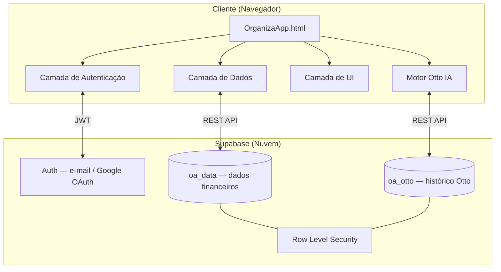
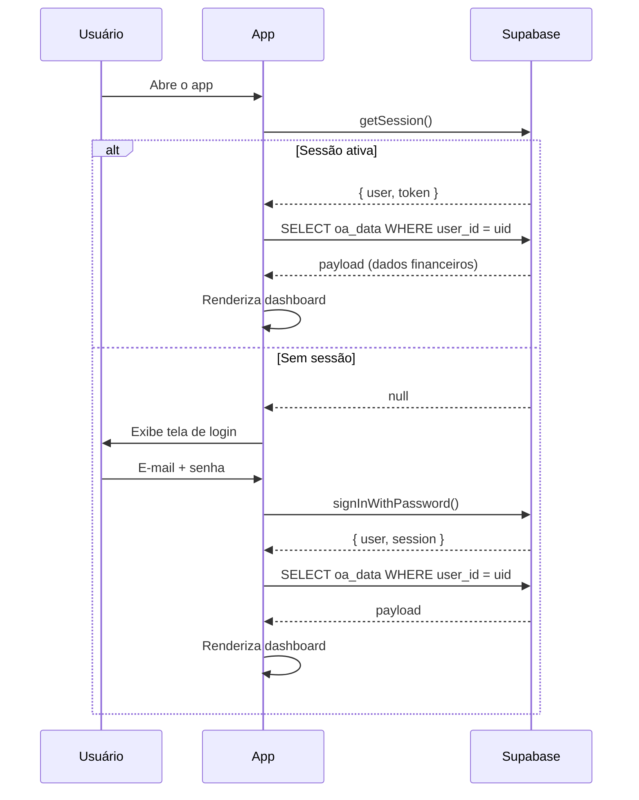
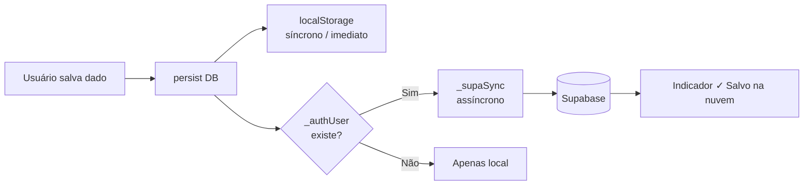
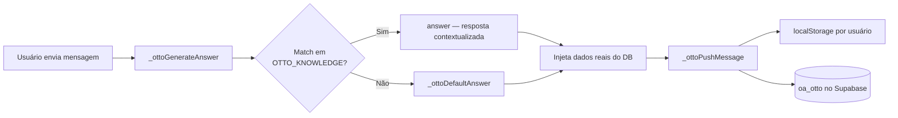

<div align="center">


# 💰 OrganizaApp+

**Dashboard financeiro pessoal com assistente de IA, autenticação e sincronização em nuvem.**  
Controle receitas, gastos, investimentos e metas — acesse de qualquer dispositivo com seus dados sempre atualizados.

[🚀 Demo ao vivo](#como-rodar) · [📸 Screenshots](#screenshots) · [🤖 Otto IA](#otto--assistente-financeiro) · [🗺️ Roadmap](#próximos-passos)

</div>

---

## 📋 Índice

- [Sobre o projeto](#sobre-o-projeto)
- [Funcionalidades](#funcionalidades)
- [Tecnologias utilizadas](#tecnologias-utilizadas)
- [Arquitetura](#arquitetura)
- [Pré-requisitos](#pré-requisitos)
- [Como rodar](#como-rodar)
- [Configuração do Supabase](#configuração-do-supabase)
- [Estrutura do projeto](#estrutura-do-projeto)
- [Otto — Assistente Financeiro](#otto--assistente-financeiro)
- [PWA — Instalação em dispositivos](#pwa--instalação-em-dispositivos)
- [Troubleshooting](#troubleshooting)
- [Próximos passos](#próximos-passos)
- [Padrão de commits](#padrão-de-commits)
- [Licença](#licença)

---

## Sobre o projeto

O **OrganizaApp+** é um dashboard financeiro pessoal que resolve um problema real: a maioria das ferramentas de controle financeiro exige instalação, assinatura paga ou abre mão da privacidade dos dados.

Este projeto entrega uma solução completa em um único arquivo HTML com:

- **Zero instalação** — abre direto no navegador
- **Autenticação real** — login com e-mail/senha ou Google via Supabase
- **Sincronização em nuvem** — dados acessíveis em qualquer dispositivo
- **Offline-first** — funciona sem internet usando cache local
- **IA embutida** — assistente financeiro sem necessidade de API key
- **Instalável** — funciona como app nativo em celular e desktop (PWA)

**Decisões técnicas relevantes:**

- **Single-file HTML** — facilita distribuição e hospedagem em qualquer serviço estático, sem etapas de build
- **Vanilla JavaScript (ES2020+)** — demonstra domínio dos fundamentos sem depender de frameworks
- **Dual-write (localStorage + Supabase)** — escrita síncrona local para resposta imediata + sincronização assíncrona com a nuvem
- **Row Level Security (RLS)** — segurança no nível do banco de dados; cada usuário só acessa seus próprios dados, mesmo que a chave pública vaze
- **Motor de IA local** — 25 tópicos financeiros embutidos com contexto dinâmico dos dados do usuário

---

## Funcionalidades

### 📊 Módulos financeiros

| Módulo | Descrição |
|--------|-----------|
| 🏠 **Dashboard** | KPIs em tempo real, gráficos de receita vs despesa, saúde financeira e alertas automáticos |
| 📈 **Receitas** | CRUD completo com categorias, status e evolução mensal |
| 📉 **Gastos** | Controle por categoria e prioridade, semáforo de orçamento, ranking dos maiores gastos |
| 💼 **Investimentos** | Portfólio com tipos, corretoras, rentabilidade estimada e distribuição em gráfico |
| 🎯 **Metas** | Progresso visual, aporte mensal e prazo estimado para conclusão |
| 🔐 **Reserva de Emergência** | Gauge de progresso, cálculo de meses cobertos, dicas de onde guardar |
| 💳 **Cartões** | Gestão de limite, fatura e risco por cartão |
| 🔄 **Assinaturas** | Serviços recorrentes com custo mensal e anual consolidados |
| 📅 **Visão Anual** | Tabela e gráfico de evolução financeira mês a mês |
| 🧮 **Simulação** | Juros compostos com três cenários (conservador, moderado, agressivo) |
| 🔔 **Notificações** | Alertas automáticos com filtros e marcação de lidas |

### 🔐 Autenticação e sincronização
- Login com **e-mail e senha**
- Login com **Google (OAuth)**
- **Sessão persistente** — ao reabrir o app, o usuário já entra automaticamente
- **Sincronização em tempo real** — indicador visual ao salvar na nuvem
- **Migração automática** — dados locais existentes são migrados para a nuvem no primeiro login
- **Botão de logout** nas configurações

### 🤖 Otto — Assistente Financeiro IA
- Base de conhecimento com **25 tópicos financeiros** especializados
- Respostas **contextualizadas** com os dados reais do usuário
- Histórico sincronizado na nuvem por usuário autenticado
- Interface dupla: **mini-chat flutuante** e **aba dedicada**
- Limite de 100 mensagens com aviso automático

---

## Tecnologias utilizadas

| Tecnologia | Versão | Uso |
|------------|--------|-----|
| **HTML5** | — | Estrutura semântica e acessibilidade |
| **CSS3** | — | Variáveis CSS, BEM, Grid, Flexbox, animações |
| **JavaScript (ES2020+)** | — | Lógica de negócio, DOM, async/await |
| **Supabase JS SDK** | 2.x | Autenticação e banco de dados na nuvem |
| **Supabase Auth** | — | Login e-mail/senha + OAuth Google |
| **Supabase PostgreSQL** | — | Banco de dados com Row Level Security |
| **Chart.js** | 4.4.1 | Gráficos de barras, linhas e donut |
| **Google Fonts** | — | DM Sans + Syne |
| **Web App Manifest** | — | PWA instalável |

> **Nenhum framework JavaScript foi utilizado intencionalmente.** A escolha de Vanilla JS demonstra domínio dos fundamentos da linguagem sem depender de abstrações.

---

## Arquitetura

### Visão geral do sistema



### Fluxo de autenticação



### Fluxo de persistência (dual-write)



### Convenções de código

- **BEM** para CSS — `.sidebar__logo`, `.kpi__value`, `.nav-item__badge`
- **`'use strict'`** habilitado em todo o JS
- **`addEventListener`** em todos os eventos — zero atributos `onclick` inline
- **Prefixo `_`** para métodos internos — `_supaSync()`, `_authLogin()`, `_ottoGenerateAnswer()`
- **`async/await`** para todas as operações assíncronas com Supabase
- **Constantes no topo** — `SUPA_URL`, `SUPA_KEY`, `STORAGE_KEY`, `OTTO_MSG_LIMIT`

---

## Pré-requisitos

| Requisito | Versão | Observação |
|-----------|--------|------------|
| **Navegador moderno** | Chrome 80+, Firefox 75+, Safari 13.1+, Edge 80+ | Nenhuma instalação necessária |
| **Conta Supabase** | — | Gratuita em [supabase.com](https://supabase.com) |
| **Projeto Supabase criado** | — | Região recomendada: South America (São Paulo) |

> Para desenvolvimento local não é necessário Node.js, Python ou qualquer runtime. Basta um navegador.

---

## Como rodar

### Opção 1 — Local (mais simples)

```bash
# Clone o repositório
git clone https://github.com/seu-usuario/organizaapp.git
cd organizaapp

# Abra no navegador
# macOS
open OrganizaApp.html

# Linux
xdg-open OrganizaApp.html

# Windows
start OrganizaApp.html
```

> ⚠️ Algumas funcionalidades PWA requerem HTTPS. Para desenvolvimento completo, use a Opção 2.

### Opção 2 — Servidor local

```bash
# Python (disponível na maioria dos sistemas)
python3 -m http.server 3000
# Acesse: http://localhost:3000

# Node.js
npx serve .
# Acesse: http://localhost:3000

# VS Code: extensão "Live Server" → botão "Go Live"
```

### Opção 3 — Deploy (produção)

**Vercel (recomendado):**
```bash
# Conecte o repositório GitHub na Vercel
# Settings → Import Project → Deploy
# URL gerada: https://organizaapp.vercel.app
```

**Netlify:**
```bash
# Drag-and-drop da pasta em app.netlify.com/drop
# ou conecte o repositório GitHub
```

**GitHub Pages:**
```
Settings → Pages → Branch: main → / (root) → Save
URL: https://seu-usuario.github.io/organizaapp/
```

---

## Configuração do Supabase

Esta é a única etapa que requer configuração externa.

### Passo 1 — Crie o projeto

1. Acesse [supabase.com](https://supabase.com) → **Start your project**
2. Entre com sua conta GitHub
3. Clique em **New project**
4. Preencha:
   - **Name:** `organizaapp`
   - **Database Password:** crie uma senha forte (guarde-a)
   - **Region:** `South America (São Paulo)`
5. Clique em **Create new project** e aguarde ~2 minutos

### Passo 2 — Execute o schema SQL

1. No painel do projeto → **Database → SQL Editor → New query**
2. Cole o conteúdo do arquivo `supabase_schema.sql`
3. Clique em **Run**
4. Resultado esperado: `Success. No rows returned`
5. Verifique em **Table Editor** — as tabelas `oa_data` e `oa_otto` devem aparecer com ícone de cadeado (RLS ativo)

### Passo 3 — Habilite o Google OAuth (opcional)

1. No painel → **Authentication → Providers → Google**
2. Ative o toggle **Enable Google provider**
3. Acesse [console.cloud.google.com](https://console.cloud.google.com)
4. Crie um projeto → **APIs & Services → Credentials → OAuth 2.0 Client ID**
5. Em **Authorized redirect URIs**, adicione:
   ```
   https://nvdunhmmxksmoxabkkvu.supabase.co/auth/v1/callback
   ```
6. Copie o **Client ID** e **Client Secret** de volta para o painel do Supabase

### Passo 4 — Configure a URL de redirecionamento

1. No painel → **Authentication → URL Configuration**
2. Em **Site URL**, coloque a URL onde o app está hospedado:
   ```
   https://organizaapp.vercel.app
   ```
3. Em **Redirect URLs**, adicione a mesma URL

> **Para desenvolvimento local**, adicione também `http://localhost:3000` na lista de Redirect URLs.

### Estrutura do banco de dados

```sql
-- Tabela: oa_data
-- Uma linha por usuário com todos os dados financeiros em JSONB
{
  "receitas":      [...],
  "gastos":        [...],
  "investimentos": [...],
  "metas":         [...],
  "cartoes":       [...],
  "assinaturas":   [...],
  "notificacoes":  [...],
  "config": {
    "nome":      "Alex",
    "iniciais":  "A",
    "moeda":     "R$",
    "orcamento": 5000,
    "metaEco":   20,
    "accent":    "#00e5a0"
  }
}

-- Tabela: oa_otto
-- Uma linha por usuário com o histórico de conversas
[
  { "id": "...", "role": "user",      "content": "...", "ts": "..." },
  { "id": "...", "role": "assistant", "content": "...", "ts": "..." }
]
```

---

## Estrutura do projeto

```
organizaapp/
│
├── OrganizaApp.html              # Aplicação completa
├── supabase_schema.sql           # Schema do banco de dados
├── README.md                     # Esta documentação
│
└── .github/
    ├── PULL_REQUEST_TEMPLATE.md
    └── ISSUE_TEMPLATE/
        ├── bug_report.md
        └── feature_request.md
```

### Estrutura interna do script JS

```
<script>
 ├── Supabase          — _supa, _supaSync, _supaLoad, _authLogin, _onAuthSuccess...
 ├── Constants         — STORAGE_KEY, MONTHS, PALETTE, OTTO_MSG_LIMIT...
 ├── Data Layer        — createDefaultDB, persist (dual-write), hydrate
 ├── Utilities         — fmt, uid, showToast, buildInitials, formatTimeAgo
 ├── Navigation        — goToPage, stepMonth, renderPage, renderAll
 ├── Chart Registry    — renderChart, Chart.defaults
 ├── Pages (×13)       — renderDashboard → renderConfig
 ├── Modal / CRUD      — FIELD_SCHEMAS, openAddModal, saveItem, deleteItem
 ├── Otto Engine       — OTTO_KNOWLEDGE (25 tópicos), _ottoGenerateAnswer
 ├── Otto UI           — toggleOttoPanel, sendOttoPanelMessage, renderOttoPage
 ├── Notifications     — generateNotifications, updateNotifBadges
 ├── UI Restore        — restoreUIFromDB
 ├── Event Wiring      — wireEvents, _wireAuthEvents (centralizados)
 └── Boot              — boot, _genAppIcon (PWA)
```

---

## Otto — Assistente Financeiro

Motor de IA local — funciona offline, sem API key, sem custos adicionais.

### Como funciona



### 25 tópicos da base de conhecimento

| # | Tópico |
|---|--------|
| 1 | Reserva de Emergência |
| 2 | Orçamento e Regra 50-30-20 |
| 3 | Investimentos para Iniciantes |
| 4 | CDB, LCI, LCA e Tesouro Direto |
| 5 | Fundos Imobiliários (FIIs) |
| 6 | Ações e Bolsa |
| 7 | Dívidas e Cartão de Crédito |
| 8 | Inflação, CDI e Selic |
| 9 | Aposentadoria e FIRE |
| 10 | Imposto de Renda em Investimentos |
| 11 | Educação Financeira Básica |
| 12 | Economizar no Dia a Dia |
| 13 | Cartão de Crédito Inteligente |
| 14 | Grandes Compras (Casa e Carro) |
| 15 | Score de Crédito |
| 16 | Metas Financeiras (método SMART) |
| 17 | Renda Extra e Renda Passiva |
| 18 | Seguros |
| 19 | Como usar o OrganizaApp+ |
| 20 | Criptomoedas |
| 21 | Negociação de Salário e CLT vs PJ |
| 22 | Finanças no Casal |
| 23 | Planejamento Fiscal |
| 24 | Psicologia Financeira |
| 25 | MEI e Empreendedorismo |

---

## PWA — Instalação em dispositivos

### Android (Chrome)
1. Abra o app → menu `⋮` → **Adicionar à tela inicial**

### iOS (Safari)
1. Abra o app → **Compartilhar** `⎙` → **Adicionar à Tela de Início**

### Desktop (Chrome / Edge)
1. Ícone `⊕` na barra de endereço → **Instalar**

---

## Troubleshooting

### ❌ Tela de login não aparece / fica em branco

**Causa:** o SDK do Supabase não carregou (sem internet ou CDN bloqueado).

**Solução:**
```html
<!-- Baixe e use localmente no lugar do CDN -->
<script src="./supabase.min.js"></script>
```
Baixe em: [cdn.jsdelivr.net/npm/@supabase/supabase-js@2](https://cdn.jsdelivr.net/npm/@supabase/supabase-js@2)

---

### ❌ Login com Google não redireciona corretamente

**Causa:** a URL do app não está na lista de Redirect URLs do Supabase.

**Solução:**
1. Supabase Dashboard → Authentication → URL Configuration
2. Adicione a URL exata onde o app está hospedado em **Redirect URLs**
3. Para desenvolvimento local: adicione `http://localhost:3000`

---

### ❌ Dados não sincronizam em outro dispositivo

**Causa:** o usuário pode estar logado com contas diferentes (e-mail vs Google).

**Solução:** verifique em Configurações qual e-mail está sendo usado. Faça logout e login com a mesma conta nos dois dispositivos.

---

### ❌ "RLS policy violation" no console

**Causa:** as políticas de Row Level Security não foram criadas corretamente.

**Solução:** execute novamente o `supabase_schema.sql` completo no SQL Editor do Supabase. Verifique se as tabelas `oa_data` e `oa_otto` têm o ícone de cadeado no Table Editor.

---

### ❌ Dados somem ao limpar o cache do navegador

**Causa esperada e corrigida:** com a integração Supabase, os dados ficam na nuvem. Limpar o cache apenas remove a cópia local. Ao fazer login novamente, os dados são carregados da nuvem automaticamente.

---

### ❌ Gráficos não aparecem

**Causa:** CDN do Chart.js não carregou.

**Solução:** baixe `chart.umd.js` em [cdnjs.cloudflare.com](https://cdnjs.cloudflare.com/ajax/libs/Chart.js/4.4.1/chart.umd.js) e use localmente:
```html
<script src="./chart.umd.js"></script>
```

---

### ❌ Avatar não atualiza em tempo real

**Causa:** campo de iniciais manuais com valor salvo sobrescrevia a geração automática.

**Solução implementada:** o campo `cfg-iniciais` usa geração automática por padrão via `buildInitials(nome)`. Deixar vazio retorna ao automático.

---

## Próximos passos

### 🔜 Curto prazo
- [ ] Filtros avançados nas tabelas (por período, categoria, valor)
- [ ] Recorrência automática — gasto fixo que aparece todo mês
- [ ] Exportar relatório em PDF com resumo mensal
- [ ] Modo claro com toggle de tema

### 🔮 Médio prazo
- [ ] Importação de extratos bancários (OFX / CSV)
- [ ] Compartilhamento de metas via link público
- [ ] Multi-moeda com conversão automática via API de câmbio gratuita
- [ ] Notificações push (via Web Push API)

### 💡 Ideias futuras
- [ ] Otto com Claude API como fallback para perguntas complexas
- [ ] Relatórios automáticos mensais por e-mail
- [ ] App nativo com Capacitor (iOS e Android) mantendo o mesmo código base

---

## Padrão de commits

Este projeto segue o padrão [Conventional Commits](https://www.conventionalcommits.org/):

```
feat:     nova funcionalidade
fix:      correção de bug
docs:     alteração na documentação
style:    formatação (sem mudança de lógica)
refactor: refatoração sem feat ou fix
perf:     melhoria de performance
chore:    tarefas de manutenção
```

**Exemplos reais deste projeto:**

```bash
feat: adiciona autenticação Supabase com email e Google OAuth
feat: implementa dual-write localStorage + Supabase
feat: adiciona assistente Otto com 25 tópicos financeiros
feat: implementa aba de Reserva de Emergência com gauge visual
fix: corrige atualização em tempo real do avatar ao digitar o nome
fix: resolve backtick literal quebrando parser JS no formatOttoText
fix: resolve RLS policy para upsert na tabela oa_data
refactor: substitui renderAll no applyConfig por atualizações diretas de DOM
perf: adiciona registro de instâncias Chart.js para evitar memory leaks
docs: cria README com diagramas Mermaid e guia de configuração Supabase
```

---

## Licença

Distribuído sob a licença **MIT**.

```
MIT License — você pode usar, copiar, modificar e distribuir
este software livremente, desde que mantenha o aviso de copyright.
```

---

<div align="center">

Feito com 💚 usando HTML, CSS, JavaScript e Supabase.

**[⬆ Voltar ao topo](#-organizaapp)**

</div>
